# VidSeek AI 🎥🔍

> **Intelligent Video Lecture Comprehension, Semantic Slicing & Interactive AI Study Platform**

VidSeek transforms hours of unstructured video lectures (from YouTube links or local video uploads) into topic-wise mini-videos, synchronized speech transcripts, semantic timestamp search, AI-powered lecture notes, and automated quizzes.

---

[](https://python.org)
[](https://flask.palletsprojects.com/)
[](https://github.com/SYSTRAN/faster-whisper)
[](https://ffmpeg.org/)
[](LICENSE)

---

## 📸 Interface & Visual Walkthrough

### 1. Home & Command Console (Dark & Light Themes)
Paste any YouTube lecture link, upload local video files up to 2GB, or run sample lectures. Features an animated particle wave background and a modern frosted glassmorphic search box.

#### Dark Mode
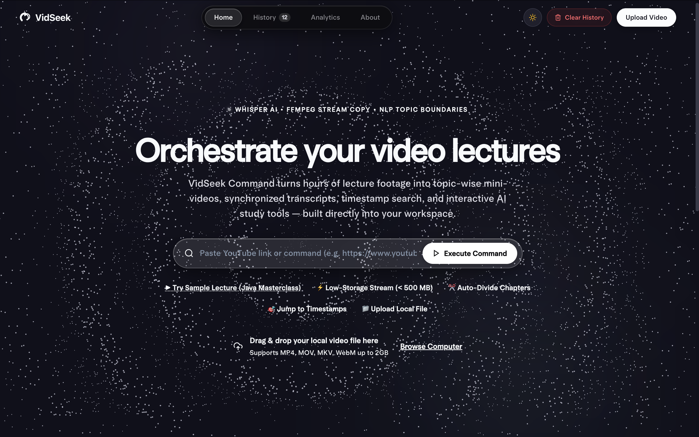

#### Light Mode (Aurora Canvas)
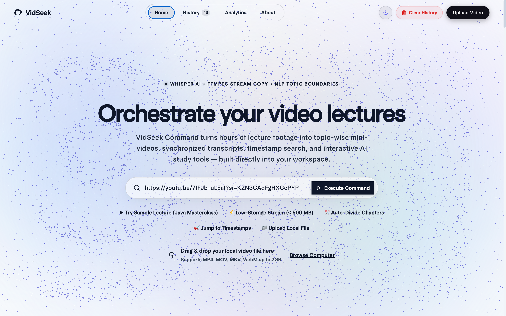

---

### 2. Multi-Stage Pipeline Engine
Real-time 6-stage video processing pipeline: URL link fetching, video stream inspection, FFmpeg audio extraction (16kHz PCM), OpenAI Whisper speech-to-text, NLP topic boundary detection, and lossless stream-copy segmentation.

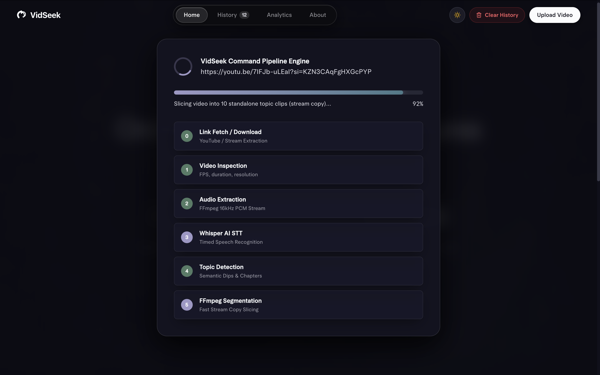

---

### 3. Interactive Video Player & Synchronized Transcript
Multi-colored interactive chapter timeline along with real-time synchronized transcript highlighting. Clicking any line instantly jumps the video to that exact millisecond.

#### Workspace Overview
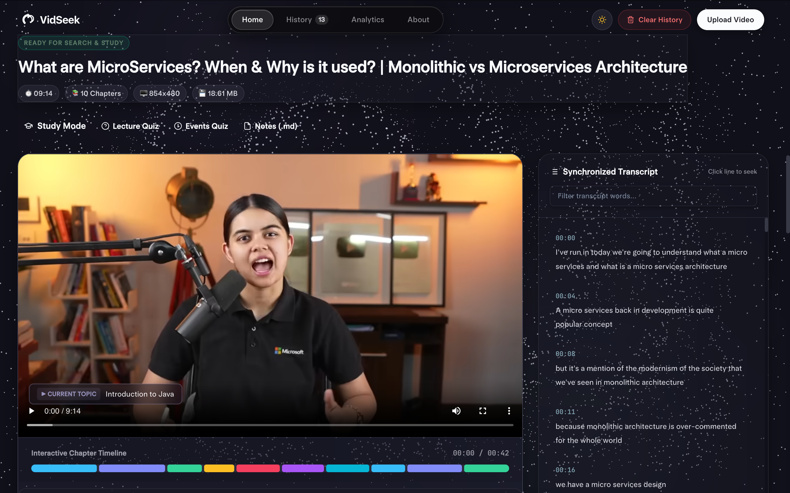

#### Active Transcript Segment Highlighting
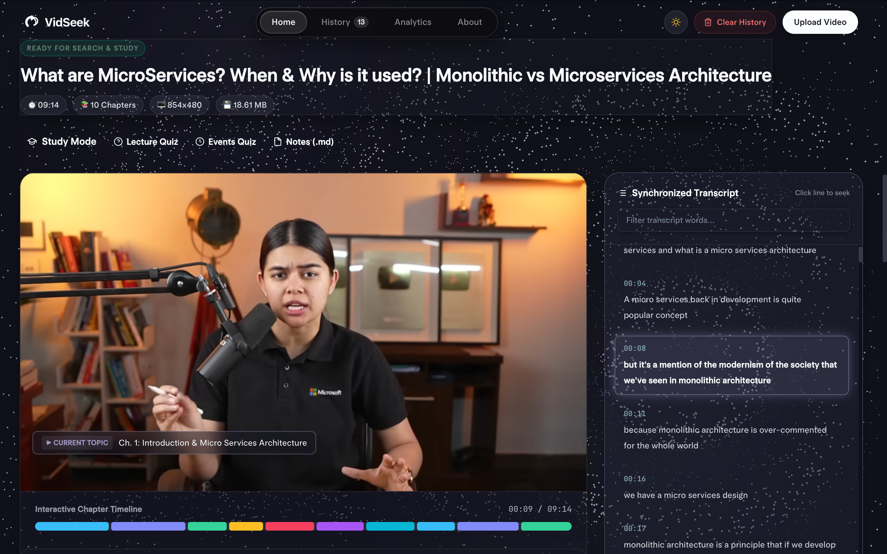

---

### 4. Topic-wise Mini-Videos (Lossless FFmpeg Stream Copy)
VidSeek automatically slices the entire lecture into standalone, topic-wise video clips without re-encoding delay. Watch clips individually or download them directly.

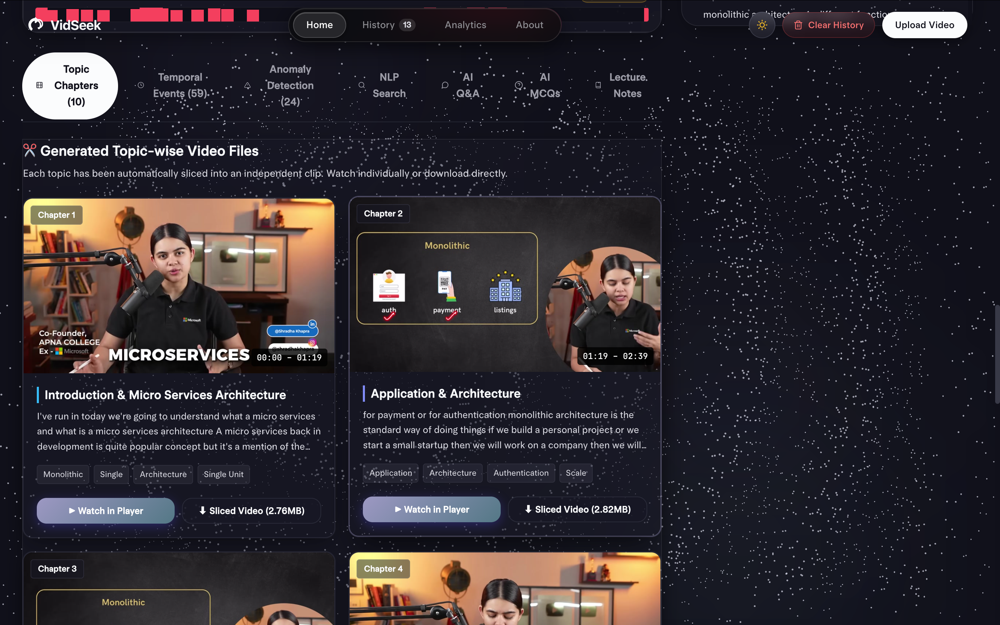

---

### 5. Deep Learning Video Intelligence

#### BiLSTM Temporal Video Understanding & Event Sequences
Models chronological event progressions across lecture video frames rather than treating frames independently.

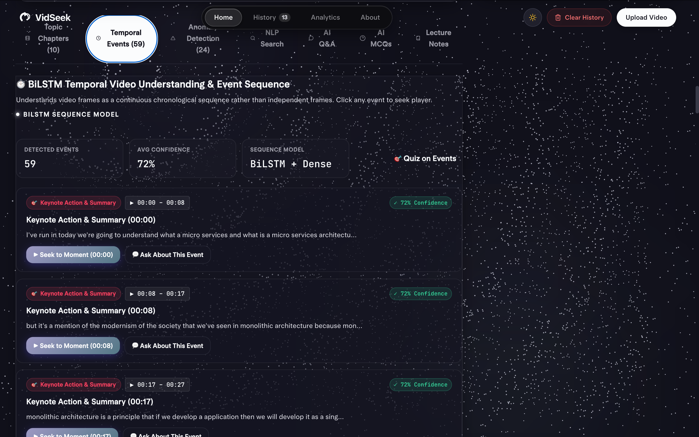

#### Autoencoder Latent Reconstruction & Anomaly Detection
Detects major slide transitions, screen luminance shifts, and notable visual changes using Mean Squared Error (MSE) reconstruction loss.

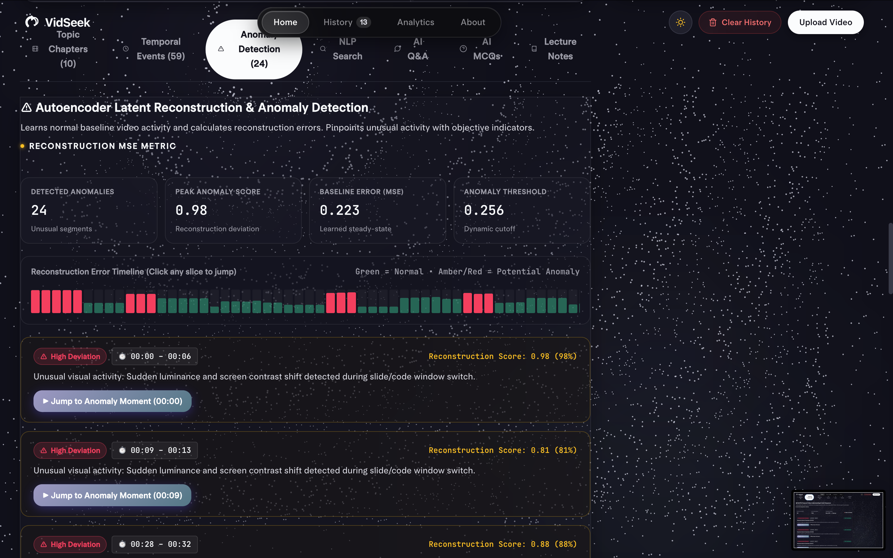

---

### 6. Semantic Search & AI Q&A Assistant

#### NLP Timestamp Search
Search through lecture contents semantically using the round transparent search bar. Get instant timestamped jump links to relevant video moments.

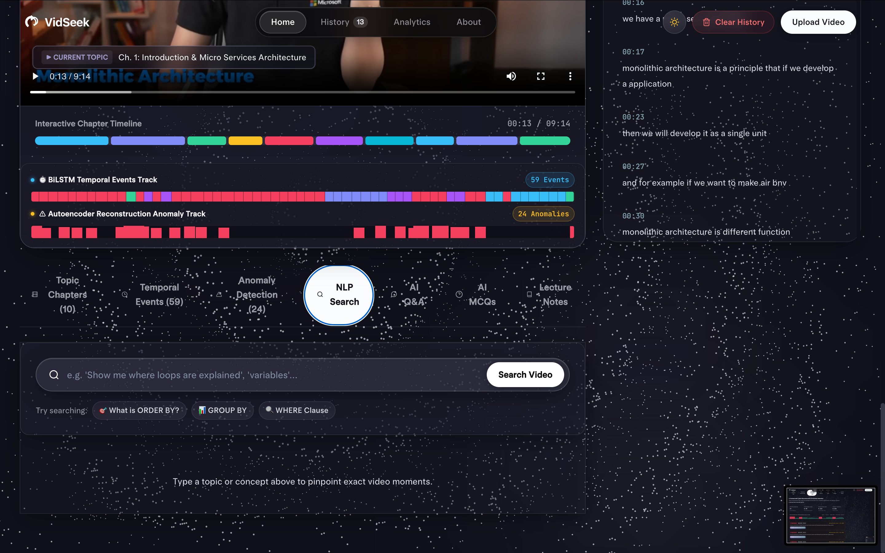

#### Interactive AI Q&A Assistant
Ask natural language questions about concepts taught in the video. The AI answers grounded in the transcript and provides direct video jump links.

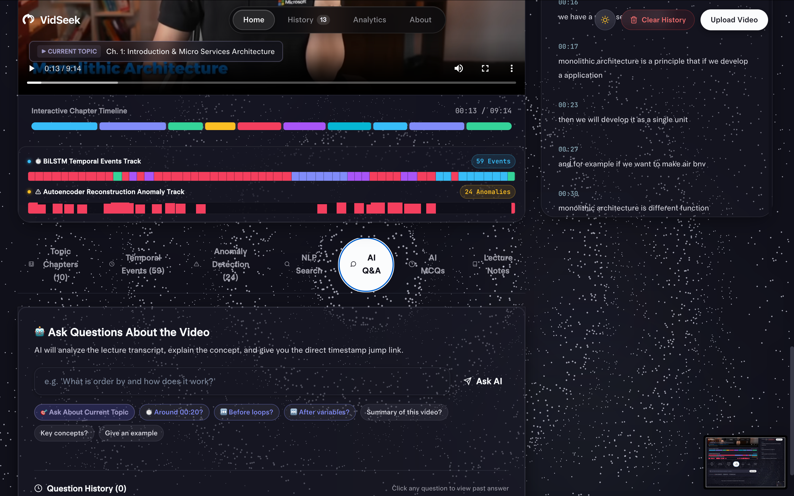

---

### 7. Interactive Quizzes & Automated Lecture Notes

#### Temporal AI MCQs
Multiple-choice questions grounded in actual detected video events and timestamps to test lecture comprehension.

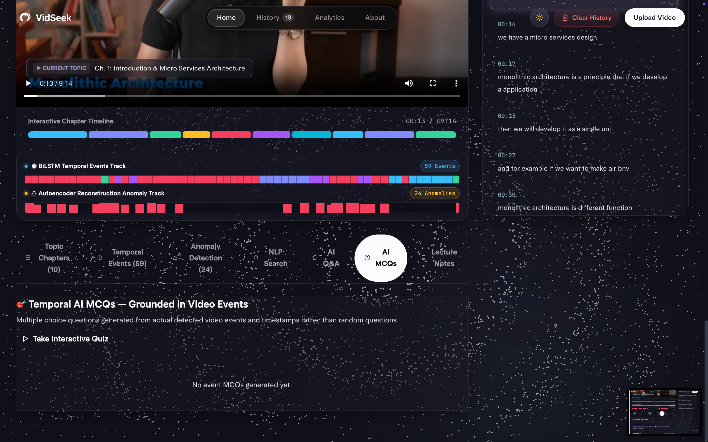

#### Auto-Generated Markdown Lecture Notes
Comprehensive structured study notes complete with table of contents, chapter summaries, key takeaways, and timestamp anchors.

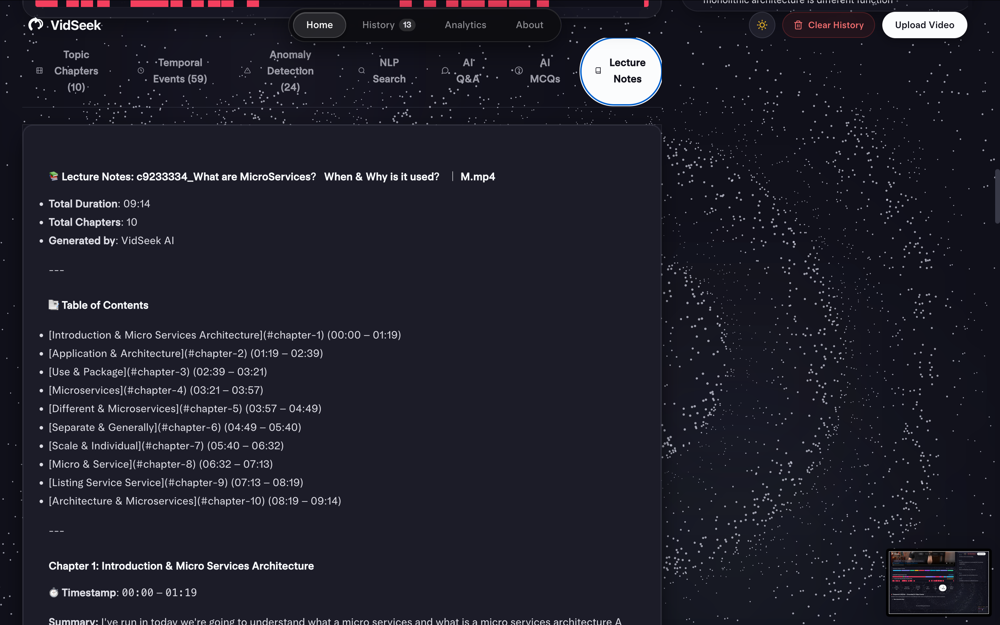

---

### 8. Persistent History Library & Learning Analytics

#### Persistent Video Library
Every uploaded or processed video is saved in the local SQLite database for instant retrieval without re-processing.

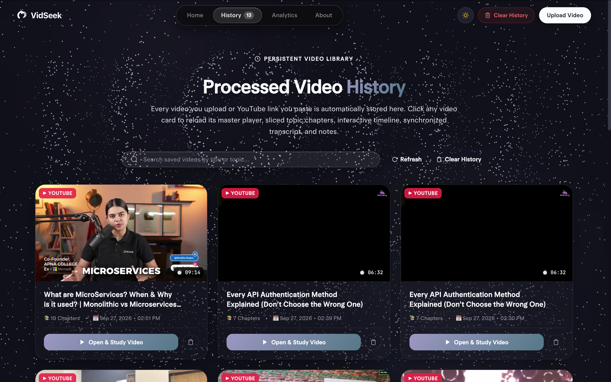

#### Learning Analytics Dashboard
Track total study time, videos analyzed, quiz accuracy, topic mastery percentage, and weekly study activity.

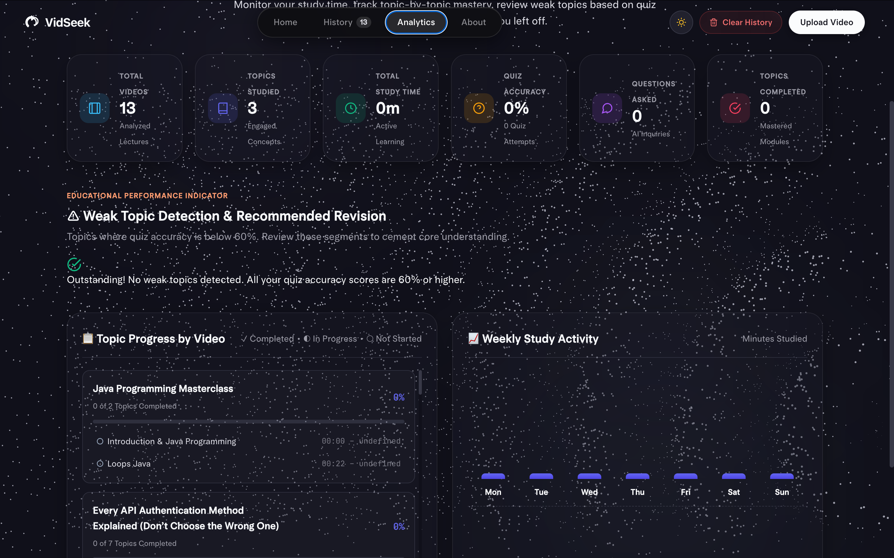

---

### 9. System & Engineering Architecture
VidSeek's 4-phase architecture: Audio Ingestion -> Whisper AI Speech-to-Text -> NLP Boundary & Topic Discovery -> Lossless Media Slicing & Query Index.

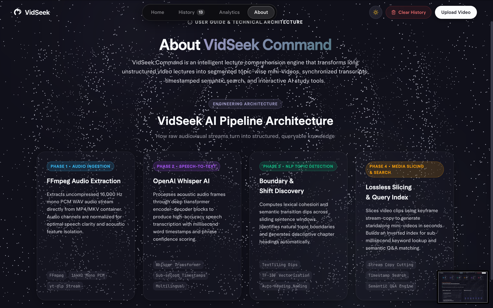

---

## ✨ Core Features

- 🎬 **Lossless Stream-Copy Slicing**: Slices videos into topic mini-videos in seconds using FFmpeg keyframe stream copying.
- 🎙️ **High-Accuracy Speech-to-Text**: Powered by `faster-whisper` with timestamp generation at word and sentence levels.
- ⏱️ **Interactive Chapter Timeline**: Visually segmented multi-color scrub bar mapped directly to lecture topics.
- 🔎 **Semantic Search & Timestamp Jumping**: Query video contents using natural language and jump straight to the answer.
- 🤖 **Video-Grounded Q&A**: Ask questions and receive concise explanations with direct video timestamp links.
- 📝 **Markdown Study Notes**: Exportable, clean markdown notes containing structured chapter breakdowns.
- 🎯 **Grounded Quizzes**: Test understanding with auto-generated multiple choice questions.
- 🧠 **BiLSTM & Autoencoder Analytics**: Advanced chronological video sequence understanding and visual anomaly detection.
- 📊 **Study Mastery Analytics**: Monitor weekly study streaks, topic completion rates, and revision recommendations.
- 🌗 **Dual-Theme Design System**: Obsidian Dark Mode and Ambient Aurora Canvas Light Mode with glassmorphic cards.

---

## 🛠️ Tech Stack

| Domain | Technologies |
|---|---|
| **Backend** | Python 3.11 / 3.12, Flask, Flask-CORS, Gunicorn |
| **Speech-to-Text** | `faster-whisper` (CTranslate2 transformer optimization) |
| **Media Processing** | FFmpeg, `imageio-ffmpeg`, `yt-dlp` |
| **Machine Learning / NLP** | `scikit-learn`, `numpy`, TextTiling / TF-IDF segmentation |
| **Database** | SQLite (`learning.db`) |
| **Frontend** | Vanilla HTML5, CSS3 Glassmorphism, JavaScript ES6+ |

---

## 🚀 Getting Started

### 1. Prerequisites
- Python 3.11+ (or 3.12)
- FFmpeg (bundled via `imageio-ffmpeg` or installed via Homebrew / apt)

### 2. Installation
```bash
# Clone the repository
git clone https://github.com/chiraglokhande/VidSeek.git
cd VidSeek

# Create and activate virtual environment
python3 -m venv .venv
source .venv/bin/activate

# Install dependencies
pip install -r requirements.txt
```

### 3. Running the Server
```bash
python app.py
```
Open your browser at **[http://127.0.0.1:5050](http://127.0.0.1:5050)**.

---

## 📁 Project Structure

```
VidSeek/
├── app.py                      # Main Flask application & API routes
├── requirements.txt            # Python dependencies
├── start.sh                    # Deployment start script
├── Dockerfile                  # Containerization specification
├── learning.db                 # SQLite database for persistent history & analytics
├── services/
│   ├── url_downloader.py       # yt-dlp low-load stream extraction (<500MB)
│   ├── transcriber.py          # faster-whisper STT engine
│   ├── video_processor.py      # FFmpeg audio extraction & stream-copy slicing
│   ├── chapter_detector.py     # NLP lexical cohesion & topic boundaries
│   ├── search_service.py       # Semantic vector & keyword retrieval
│   ├── notes_generator.py      # Structured Markdown note generation
│   ├── quiz_generator.py       # Interactive MCQ quiz generator
│   └── temporal_analyzer.py    # BiLSTM event & Autoencoder anomaly models
├── static/
│   ├── css/
│   │   ├── style.css           # Core component stylesheet
│   │   ├── mercury-bundle.css  # Layout & typography tokens
│   │   └── mercury-custom.css  # Glassmorphic themes & round search boxes
│   └── js/
│       └── app.js              # Frontend interactive application logic
├── templates/
│   └── index.html              # Single-page application UI
└── docs/
    └── screenshots/            # Showcase images for documentation
```

---

## 📄 License

This project is licensed under the [MIT License](LICENSE).
